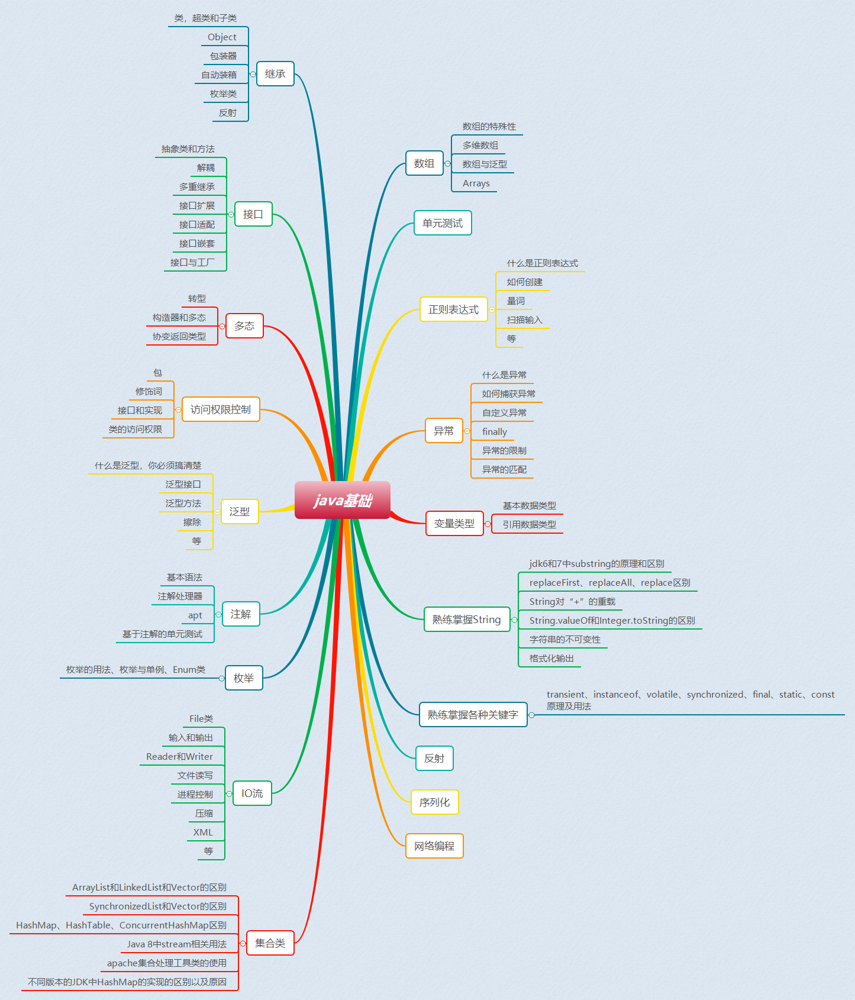
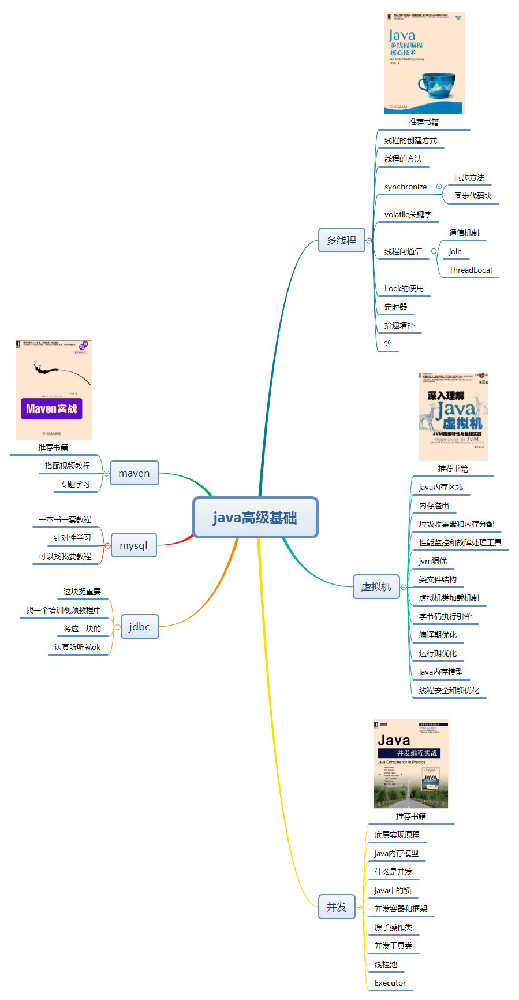
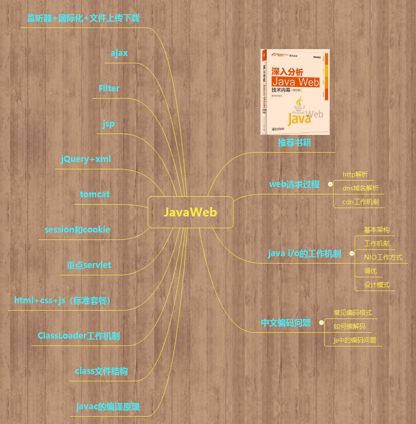
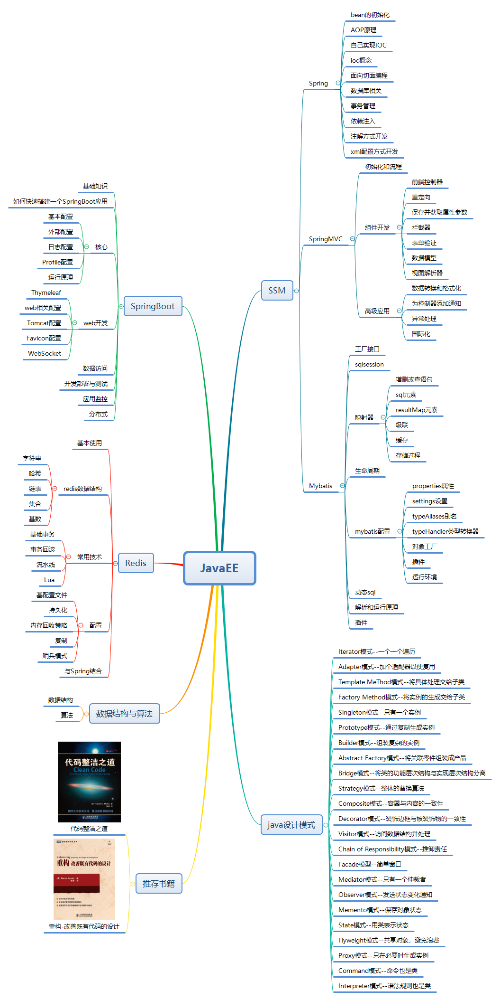

# Java基础（也就是javaSE）

> 这块建议看一个视频教程，最好是培训班的培训教程（可以找我要），然后你需要掌握以下内容

## 知识点大纲

1. 变量类型
2. 继承，接口和多态
3. 数组，主要掌握而且数组
4. 单元测试
5. 正则表达式
6. 访问权限修饰控制符，这个蛮重要，觉得常被忽略
7. 异常
8. 泛型，初学者估计对这个懵逼
9. 注解，对初学者同样有难度
10. 字符串，java基础知识标配了
11. 枚举类
12. java中的各种关键字
13. 反射，后面好多高级知识都用到这家伙
14. IO流，总觉得学会它才能做一点东西。
15. 网络编程
16. 集合类
17. 序列化，有人说坏处大于好处，现在也听说官方准备取消序列化，这就尴尬了。

> 注意：以上知识点没有按照顺序，想到哪个就写哪个了。

## 思维导图版知识点

## 学习建议

永远记住这几个字：看三遍，读三遍，敲三遍！

什么意思呢？就是你在学习java基础知识的时候强烈建议你一定要多上手，真的，想当然和实际情况有时候差别真的不是一点两点，只有自己亲自实践过了才会知道。

强调一点，专注，才能追求卓越！

# Java高级基础（估计是我第一个这么叫的）

我个人认为学完java基础知识以后可以有针对性的学习一下以下知识，这些知识在基础之上，接近高级，而且在以后用到的是比较多的，是java程序员必须具备的技能。

1. 多线程-----推荐书籍：**java多线程编程核心技术**
2. java虚拟机----推荐书籍：**深入理解java虚拟机**
3. java并发-----推荐书籍：**java并发编程实战**
4. JDBC
5. MySql
6. Maven

## 思维导图

> 个人觉得这是一个分水岭阶段，对于以上知识的掌握，慢慢的就区分开你与别人的差距了，是甩别人还是被别人甩就看你自己了

# 养一只猫

你肯定会说？？？？？什么玩意啊，这不是学习java的吗？干嘛让我养猫啊，可是这只猫你还真的要养，而且必须好好养！

 

对就是它---java程序员必须养的一只宠物猫Tomcat。

言归正传，关于tomcat的学习可以进行专题化的学习方式，就是集中式学习，看视频教程，看书，看博客等，然后记好笔记，以后会经常使用tomcat的。

起码你要掌握以下知识点

1. tomcat的目录结构
2. tomcat的安装
3. 如何配置
4. 一些常见错误的解决
5. 如何使用
6. server.xml文件的配置等

# JavaWeb学习

## 思维导图

关于javaweb的学习，我建议通过视频教程+书的形式去学习，书籍已经推荐过了，视频教程可以找我要。

# JavaEE---重中之重

首先搞定SSM三大框架，然后去学习Redis，紧接着系统学习SpringBoot。这是我目前的学习路径，进入javaEE的学习就要记住或者说围绕以下几点来学习了。

1. 高并发
2. 高响应
3. 数据一致性
4. 技术复杂性

像分布式，微服务之类的，一般大公司都会要求，只是目前我水平有限，在以后的学习中会不断的进行补充！

## 思维导图

## 主要技术点

1. SSM---标准框架套餐
2. Redis
3. 设计模式
4. 数据结构与算法
5. SpringBoot